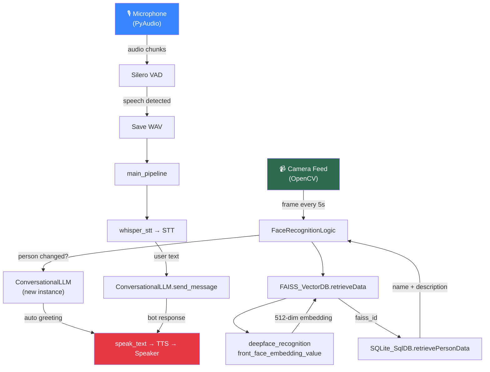
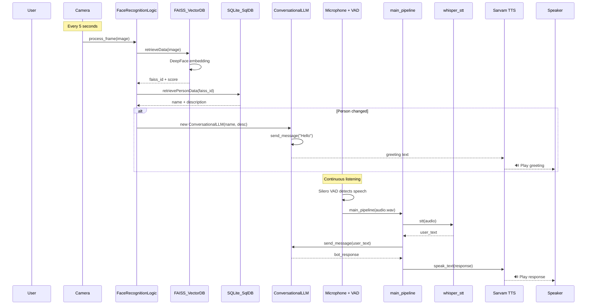

# Vayu — Interactive Face Recognition Bot: Project Flow

## Overview

**Vayu** is a real-time, interactive face recognition chatbot built for fest/event scenarios. It recognizes a person through a live camera feed, greets them by name, and carries on a voice conversation — all powered by DeepFace, FAISS, Groq LLM, Whisper STT, and Sarvam TTS.

---

## Architecture Diagram



---

## Entry Point: [live_face_recognition.py](file:///Users/aryanvarshney/Downloads/Vayu_InteractiveFaceRecognitionBot/live_face_recognition.py)

This is the **main script** that orchestrates everything. When run (`python live_face_recognition.py`), it:

### 1. Initializes global resources (lines 16–36)
- Configures **audio settings** (16kHz, mono, 512-sample chunks).
- Loads the **Silero VAD** (Voice Activity Detection) model via `torch.hub`.
- Creates a **`shared_state`** dictionary — the central communication bus between threads:

| Key | Purpose |
|---|---|
| `current_name` | Name of the currently recognized person |
| `current_description` | Description of the currently recognized person |
| `current_conversation` | Active [ConversationalLLM](file:///Users/aryanvarshney/Downloads/Vayu_InteractiveFaceRecognitionBot/utils/conversational_llm.py#7-31) instance |
| `bot_is_speaking` | Flag to mute mic while the bot speaks |
| `running` | Flag to signal shutdown |

### 2. Starts [start_live_recognition()](file:///Users/aryanvarshney/Downloads/Vayu_InteractiveFaceRecognitionBot/live_face_recognition.py#175-236) (lines 175–235)
This function kicks off two parallel loops:

#### A. Video Loop (main thread)
1. Creates a [FaceRecognitionLogic](file:///Users/aryanvarshney/Downloads/Vayu_InteractiveFaceRecognitionBot/utils/face_recognition_logic.py#4-33) instance.
2. Opens the camera (`cv2.VideoCapture(0)`).
3. Immediately processes the **first frame**.
4. Enters a loop: every **5 seconds**, captures a frame and calls [process_frame()](file:///Users/aryanvarshney/Downloads/Vayu_InteractiveFaceRecognitionBot/live_face_recognition.py#39-94).
5. Displays the recognized name overlaid on the video feed.
6. Quits on pressing `q`.

#### B. Audio Loop (daemon thread via [audio_recording_thread()](file:///Users/aryanvarshney/Downloads/Vayu_InteractiveFaceRecognitionBot/live_face_recognition.py#96-173), lines 96–172)
1. Opens the microphone stream via PyAudio.
2. Continuously reads audio chunks and feeds them to **Silero VAD**.
3. **While the bot is speaking** (`bot_is_speaking == True`), audio is discarded.
4. When speech is detected, chunks are buffered.
5. When **silence** is detected (≥0.5s), the buffer is saved as a temp WAV file and sent to [main_pipeline()](file:///Users/aryanvarshney/Downloads/Vayu_InteractiveFaceRecognitionBot/utils/main_pipeline.py#73-111).

### 3. [process_frame()](file:///Users/aryanvarshney/Downloads/Vayu_InteractiveFaceRecognitionBot/live_face_recognition.py#39-94) (lines 39–93)
- Saves the frame to [live_recognition/current_frame.jpg](file:///Users/aryanvarshney/Downloads/Vayu_InteractiveFaceRecognitionBot/live_recognition/current_frame.jpg).
- Calls `FaceRecognitionLogic.recognise_face()` to identify the person.
- **If the person is the same** as before → no action.
- **If the person changed** → creates a *new* [ConversationalLLM](file:///Users/aryanvarshney/Downloads/Vayu_InteractiveFaceRecognitionBot/utils/conversational_llm.py#7-31) instance, stores it in `shared_state`, and spawns a background thread that sends "Hello" to trigger an **auto-greeting** via TTS.

---

## Utils Module Breakdown

### [face_recognition_logic.py](file:///Users/aryanvarshney/Downloads/Vayu_InteractiveFaceRecognitionBot/utils/face_recognition_logic.py) — Orchestrator

The glue between the vector DB and the SQL DB.

| Method | Flow |
|---|---|
| [recognise_face(image_path)](file:///Users/aryanvarshney/Downloads/Vayu_InteractiveFaceRecognitionBot/utils/face_recognition_logic.py#9-33) | Calls `FAISS_VectorDB.retrieveData()` → gets `faiss_id` + similarity → calls `SQLite_SqlDB.retrievePersonData(faiss_id)` → returns `{name, description}` or `None` |

---

### [deepface_recognition.py](file:///Users/aryanvarshney/Downloads/Vayu_InteractiveFaceRecognitionBot/utils/deepface_recognition.py) — Face Embedding

Single function: [front_face_embedding_value(img_path)](file:///Users/aryanvarshney/Downloads/Vayu_InteractiveFaceRecognitionBot/utils/deepface_recognition.py#4-32)

1. Uses **DeepFace** with the **Facenet512** model and **MTCNN** detector.
2. If multiple faces found, picks the **largest** one (assumed to be the front face).
3. **L2-normalizes** the 512-dim embedding (so inner product = cosine similarity).
4. Returns the embedding vector, or `[]` on failure.

---

### [faiss_db.py](file:///Users/aryanvarshney/Downloads/Vayu_InteractiveFaceRecognitionBot/utils/faiss_db.py) — Vector Database

Class: [FAISS_VectorDB](file:///Users/aryanvarshney/Downloads/Vayu_InteractiveFaceRecognitionBot/utils/faiss_db.py#6-66)

| Method | Purpose |
|---|---|
| [__init__()](file:///Users/aryanvarshney/Downloads/Vayu_InteractiveFaceRecognitionBot/utils/face_recognition_logic.py#5-8) | Loads existing [face_index.faiss](file:///Users/aryanvarshney/Downloads/Vayu_InteractiveFaceRecognitionBot/face_index.faiss) from disk, or creates a new `IndexFlatIP` (inner product) wrapped in `IndexIDMap` |
| [insertData(image_paths, next_id)](file:///Users/aryanvarshney/Downloads/Vayu_InteractiveFaceRecognitionBot/utils/faiss_db.py#28-50) | Generates embeddings for each image via [front_face_embedding_value()](file:///Users/aryanvarshney/Downloads/Vayu_InteractiveFaceRecognitionBot/utils/deepface_recognition.py#4-32), assigns sequential IDs starting from `next_id`, adds to FAISS index |
| [retrieveData(image_path, k)](file:///Users/aryanvarshney/Downloads/Vayu_InteractiveFaceRecognitionBot/utils/faiss_db.py#51-61) | Generates embedding for query image, searches FAISS for top-`k` nearest neighbors, returns [(similarities, ids)](file:///Users/aryanvarshney/Downloads/Vayu_InteractiveFaceRecognitionBot/whisper_stt.py#8-22) |
| [save_faiss_index()](file:///Users/aryanvarshney/Downloads/Vayu_InteractiveFaceRecognitionBot/utils/faiss_db.py#62-66) | Persists the index to [face_index.faiss](file:///Users/aryanvarshney/Downloads/Vayu_InteractiveFaceRecognitionBot/face_index.faiss) |

---

### [sqlite_db.py](file:///Users/aryanvarshney/Downloads/Vayu_InteractiveFaceRecognitionBot/utils/sqlite_db.py) — Relational Database

Class: [SQLite_SqlDB](file:///Users/aryanvarshney/Downloads/Vayu_InteractiveFaceRecognitionBot/utils/sqlite_db.py#3-136) — manages [face_database.db](file:///Users/aryanvarshney/Downloads/Vayu_InteractiveFaceRecognitionBot/face_database.db)

**Schema:**
```
persons (person_id PK, name, description)
    ↕ 1:N
face_embeddings_id (faiss_id PK, person_id FK → persons)
```

| Method | Purpose |
|---|---|
| [insertDataIntoTable(faiss_ids, name, description)](file:///Users/aryanvarshney/Downloads/Vayu_InteractiveFaceRecognitionBot/utils/sqlite_db.py#93-118) | Inserts a person, then maps each `faiss_id` to that person |
| [retrievePersonData(faiss_id)](file:///Users/aryanvarshney/Downloads/Vayu_InteractiveFaceRecognitionBot/utils/sqlite_db.py#43-71) | JOINs tables to get [(name, description)](file:///Users/aryanvarshney/Downloads/Vayu_InteractiveFaceRecognitionBot/whisper_stt.py#8-22) for a given FAISS ID |
| [maxFaissId()](file:///Users/aryanvarshney/Downloads/Vayu_InteractiveFaceRecognitionBot/utils/sqlite_db.py#119-136) | Returns the current max FAISS ID (for assigning new IDs) |
| [queryDataFromTable(query)](file:///Users/aryanvarshney/Downloads/Vayu_InteractiveFaceRecognitionBot/utils/sqlite_db.py#72-92) | Generic raw SQL query runner |

---

### [conversational_llm.py](file:///Users/aryanvarshney/Downloads/Vayu_InteractiveFaceRecognitionBot/utils/conversational_llm.py) — LLM Chat

Class: [ConversationalLLM](file:///Users/aryanvarshney/Downloads/Vayu_InteractiveFaceRecognitionBot/utils/conversational_llm.py#7-31)

- Initialized with a person's **name** and **description**.
- Sets a system prompt: *"You are a conversational chatbot made by CICR, at a fest event, talking to {name}..."*
- Uses **Groq API** with `llama-3.3-70b-versatile` model.
- [send_message(user_text)](file:///Users/aryanvarshney/Downloads/Vayu_InteractiveFaceRecognitionBot/utils/conversational_llm.py#14-31) appends to chat history and returns the LLM's response (max 150 tokens, temp 0.7).
- Maintains full conversation history for context.

---

### [main_pipeline.py](file:///Users/aryanvarshney/Downloads/Vayu_InteractiveFaceRecognitionBot/utils/main_pipeline.py) — STT → LLM → TTS Pipeline

Two key functions:

#### [main_pipeline(audio_path, shared_state)](file:///Users/aryanvarshney/Downloads/Vayu_InteractiveFaceRecognitionBot/utils/main_pipeline.py#73-111) (line 73)
Three-step sequential pipeline:
1. **STT** → `whisper_stt.stt(audio_path)` — transcribes audio to text using Faster-Whisper.
2. **LLM** → `conversation.send_message(user_text)` — sends transcript to Groq LLM.
3. **TTS** → [speak_text(response, shared_state)](file:///Users/aryanvarshney/Downloads/Vayu_InteractiveFaceRecognitionBot/utils/main_pipeline.py#58-71) — converts response to speech.

#### [speak_text(text, shared_state)](file:///Users/aryanvarshney/Downloads/Vayu_InteractiveFaceRecognitionBot/utils/main_pipeline.py#58-71) (line 58)
1. Sets `bot_is_speaking = True` (mutes mic input).
2. Calls [_tts_to_file()](file:///Users/aryanvarshney/Downloads/Vayu_InteractiveFaceRecognitionBot/utils/main_pipeline.py#14-38) — async Sarvam AI TTS, streams audio chunks to [tts_output.mp3](file:///Users/aryanvarshney/Downloads/Vayu_InteractiveFaceRecognitionBot/tts_output.mp3).
3. Calls [_play_audio_file()](file:///Users/aryanvarshney/Downloads/Vayu_InteractiveFaceRecognitionBot/utils/main_pipeline.py#40-56) — plays the MP3 via PyAudio.
4. Sets `bot_is_speaking = False` after a 200ms buffer.

---

## Root-Level Utility Scripts

### [whisper_stt.py](file:///Users/aryanvarshney/Downloads/Vayu_InteractiveFaceRecognitionBot/whisper_stt.py) — Speech-to-Text

- Loads `faster-whisper` **base** model on CPU with int8 quantization.
- [stt(audio_path)](file:///Users/aryanvarshney/Downloads/Vayu_InteractiveFaceRecognitionBot/whisper_stt.py#8-22) → transcribes audio, returns the full text string.

### [self_data_upload.py](file:///Users/aryanvarshney/Downloads/Vayu_InteractiveFaceRecognitionBot/self_data_upload.py) — Data Ingestion Tool

A standalone CLI script to **populate the face database**:
1. Takes a folder name as input.
2. For each subfolder (representing a person):
   - Collects all image files.
   - Reads `description.txt` if it exists.
   - Generates FAISS embeddings and inserts them into the vector DB.
   - Creates the person record in SQLite and links the FAISS IDs.
3. Saves the FAISS index to disk.

---

## End-to-End Flow Summary


